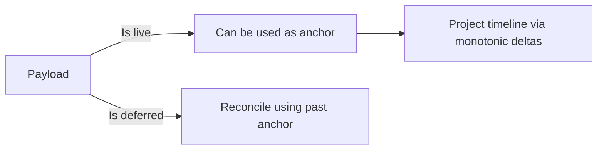

# Server design

We are effectively dealing with fault-tolerant computing and eventual accuracy. There are several concepts in play:

- **Completeness:** a genuinely off system is eventually detected.
- **Accuracy:** a healthy system is not suspected.
- **Eventual accuracy:** a healthy system may be temporarily suspected.
- **Event time processing**: discrete events are converted into continual metric.

## Ingestion

Since heartbeat collection is a fault-sensitive responsibility, the actual ingestion is performed by Observatorium (as a OpenTelemetry implementation) acting as an API gateway in front of Loki, Mimir, Prometheus.

### Payload

The host includes the following information as its heartbeat:

- RHSM UUID
- RHSM ORG ID
- Boot ID
- Wall-clock time
- Monotonic time (in nanoseconds, does not include suspend time)
- Boot time (in nanoseconds, includes suspend time)
- Type ("ping", "poweroff", "restart", ...)
- Live (boolean) (set to `false` for deferred uploads)

The ingestion server itself includes Ingestion time.

## Determining heartbeat time

On heartbeat receive, the server must separate out traffic it believes it should trust from the one it should not.



### Live heartbeat anchoring

When `live=true`, the server establishes a trusted time anchor point `T_anchor` for the active `boot_id`:

- `T_anchor = ingestion-time`,
- `M_anchor = monotonic-time`.

### Deferred heartbeat anchoring

When a host flushes buffered heartbeats after a network outage, the ingestion time represents the flush moment, not the event occurrence. The timestamp `T_i` of any deferred payload `i` is derived from the relative monotonic delta using the trusted time anchor established before. If none exists, ingestion time is used.

- `T_i = T_anchor - (M_anchor - M_i)`.

## Interval reconstruction

If no subsequent heartbeats arrive within the interval (10 minutes), the backend may set the system state to **lost** at `T_last + 10m` ("the dying gasp").

### Suspend

Transitions between states are computed deterministically across consecutive heartbeats `P_1 -> P_2` within the same `boot_id`.

Having `ΔM = M_2 - M_1` (a difference between monotonic times), `ΔB = B_2 - B_1` (a difference between boot times), and `ε` a scheduling jitter threshold (a few seconds):

- `ΔB - ΔM <= ε` implies the host has been **online**.
- `ΔB - ΔM > ε` implies the host has been **suspended** for `ΔB - ΔM` nanoseconds.

### Reboot

To resolve missing `off` signals and avoid double-charging during reboot, window bounds are merged while ignoring `boot_id`s. When a new `boot_id` is observed, we may calculate its true start timestamp, and the closing timestamp for the previous boot may be capped:

- `T_boot_2 = T_ping_2 - M_ping_2`.
- `T_end_1 = min(T_last_1 + 10m, T_poweroff_1, T_boot_2)`.

This guarantees that a reboot occuring within the 10-minute dying gasp window truncates the previous session at `T_boot_2`, eliminating the double-billing overlap.

## State reconstruction

The logic described above is too complicated to be encoded within LogQL. Instead, some lightweight consumer should stand behind Loki to interpret the data by itself.

### Lifetime reconstructions

Given the possibility of deferred uploads, the state reconstruction must not be considered complete until the deferral period (72 hours).

This additional service may need to merge the discrete events into continuous intervals. It could model it like so:

```sql
CREATE TABLE IF NOT EXISTS intervals (
    org_id    VARCHAR(16) NOT NULL,
    rhsm_uuid UUID NOT NULL,
    boot_id   UUID NOT NULL,
    start     TIMESTAMP WITH TIME ZONE NOT NULL,
    end       TIMESTAMP WITH TIME ZONE NOT NULL,
    state     VARCHAR(16) NOT NULL, -- 'ONLINE', 'SUSPEND', 'RESTART', ...
    PRIMARY KEY (rhsm_uuid, boot_id, start)
)
```

For queries older than 72 hours, the data may be considered immutable, with late arrivals dropped or flagged. For SWatch queries for "younger" data, the history isn't settled yet, and the service might offer a proxy that will likely change between reads.

### No state reconstruction

Since the systems already report the monotonic time, which does not include the time the system has been suspended, we already have everything we need to bill for that system.

In this context, the backend needs to determine how much the sum of all systems have consumed within a given time period. If we didn't need to reconstruct the host lifetime from the heartbeats we receive, the whole backend infrastructure would be trivial.

```
RHSM_UUID  BOOT_ID  CLOCK_BOOT  CLOCK_MONOTONIC  TYPE  TIME_INGESTION | TOTAL TIME  TRACKED STATE
abc        12          1:50:23          1:50:23  ping        09:19:42 | 6623 + 478   clamped gasp
cde        45        784:20:02        557:47:12   off        09:19:44 |    2008032            off
abc        13          0:08:12          0:08:12  ping        09:29:46 |        492         online
cde        46          0:00:54          0:00:54  ping        09:29:48 |         54         online
```

Without state reconstruction, deferred heartbeats might not be required at all. Instead of keeping _6 x 24_ hearbeat signals per day per machine, we would only need one -- the latest one. The only state tracking would be "the dying gasp" handling, and making sure a system that did not send an "off" heartbeat does not overlap with its next boot.
